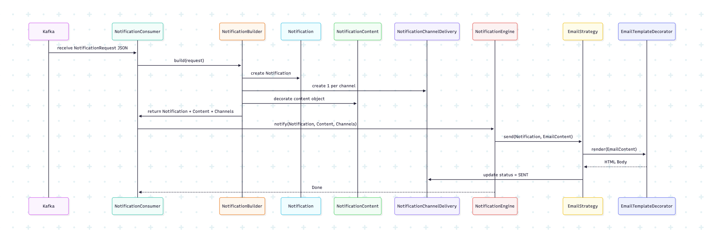
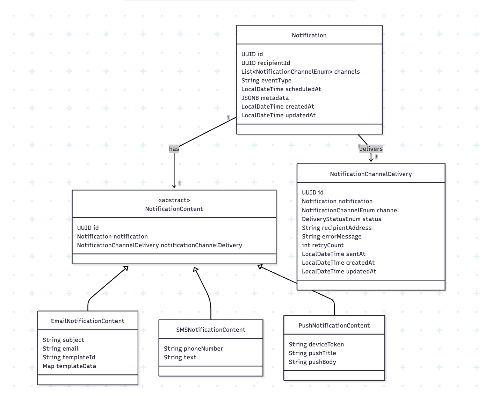
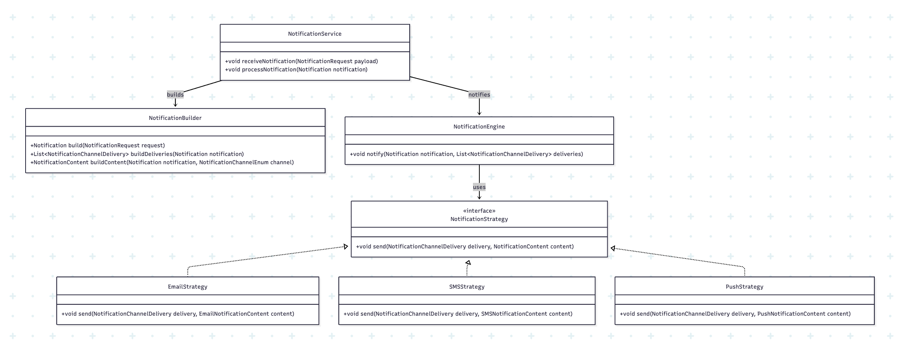

# 📬 Notification Service

A scalable and extensible microservice built using **Spring Boot**, **PostgreSQL**, and **Kafka**, responsible for delivering notifications across multiple channels — **Email**, **SMS**, and **Push** — using a polymorphic and channel-agnostic model.

---

## 🚀 Features

- Multi-channel notification delivery (Email, SMS, Push)
- Scheduled notification support
- Kafka consumer-based processing
- Polymorphic content model using `SINGLE_TABLE` inheritance
- Easily extensible for future channels

---

## 🧠 Core Concepts

- `Notification`: High-level representation of an event to notify.
- `NotificationContent`: Polymorphic superclass holding content data for each channel.
- `EmailNotificationContent`, `SMSNotificationContent`, `PushNotificationContent`: Specific content types stored in a single table using inheritance.
- `NotificationChannelDelivery`: Channel-specific status and metadata (e.g., delivery status, error, retry count).

---

## 🧩 Sequence Diagram



---

## Class Diagram
### Notification Model Class Diagram


### Notification Service Class Diagram (Flow)


---

## 📂 Directory Structure

```
notification-service/
│
├── controller/
│   └── NotificationController.java
│
├── entity/
│   ├── Notification.java
│   ├── NotificationContent.java
│   ├── EmailNotificationContent.java
│   ├── SMSNotificationContent.java
│   ├── PushNotificationContent.java
│   └── NotificationChannelDelivery.java
│
├── repository/
│   └── JpaRepositories...
│
├── service/
│   └── NotificationService.java
│
├── consumer/
│   └── KafkaNotificationConsumer.java
│
└── config/
    └── KafkaConfig.java
```

---

## 📨 Example Payload

### Channels --> Email (template-based) + PUSH + SMS

```json
{
  "recipientId": "user-uuid",
  "channels": [
    "EMAIL", "PUSH", "SMS"
  ],
  "eventType": "USER_REGISTERED",
  "scheduledAt": null,
  "metadata": {},
  "recipients": [
    {
      "channel": "EMAIL",
      "recipient": "ajay@example.com",
      "content": {
        "templateId": "welcome_email",
        "subject": "Welcome to FineMeet!",
        "templateData": {
          "name": "Ajay",
          "verificationLink": "https://finemeet.in/auth/verify?token=abc123"
        }
      }
    },
    {
      "channel": "PUSH",
      "recipient": "device_token_fcm_xyz",
      "content": {
        "pushTitle": "Event Reminder",
        "pushBody": "You have a meeting at 10 AM"
      }
    },
    {
      "channel": "SMS",
      "recipient": "+919999999999",
      "content": {
        "smsBody": "Welcome Ajay! Your OTP is 123456"
      }
    }
  ]
}
```

---


---

## 🔑 Design Principles

* **Polymorphic Content Modeling**:

    Using `@Inheritance(strategy = SINGLE_TABLE)` with `@DiscriminatorColumn` for shared NotificationContent table.
* **Channel-Aware Delivery**: 

    Each channel has its own delivery tracking (`NotificationChannelDelivery`) with independent status, retry, and error logging.
* **Extensibility**: 

    Add new channel types by extending `NotificationContent` and updating `NotificationService`.
* **Retry Handling**: 

    Track per-channel retry counts and error messages.
* **Scheduling**: 

    Notifications scheduled with `scheduledAt` will be picked up by a scheduler/cron job (to be implemented).

---

## 🛠️ Tech Stack

* **Java 21**, **Spring Boot 3.***
* **PostgreSQL**, **JPA** (for ORM)
* **Apache Kafka** (for async processing)
* **Lombok**, **Jackson**
* **Docker**

---
Feel free to contribute by adding new channels, improving error handling, or enhancing the scheduling mechanism!